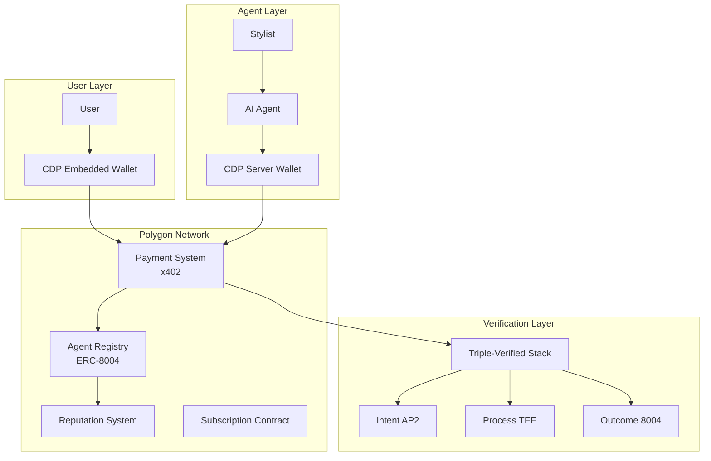

# TECHNICAL INTEGRATION GUIDE

## ARCHITECTURE OVERVIEW



---

## SMART CONTRACT ARCHITECTURE

### 1. Agent Registry (ERC-8004)

```solidity
// contracts/AgentRegistry.sol
pragma solidity ^0.8.20;

import "@openzeppelin/contracts/access/Ownable.sol";
import "@openzeppelin/contracts/utils/Counters.sol";

interface IERC8004 {
    struct Agent {
        address owner;          // Stylist who created agent
        address wallet;         // CDP Server Wallet address
        string metadataURI;     // IPFS URI for agent details
        uint256 reputation;     // Reputation score (0-1000)
        uint256 totalSales;     // Total sales in USDC
        bool verified;          // Verified stylist status
    }

    event AgentRegistered(uint256 indexed agentId, address owner);
    event ReputationUpdated(uint256 indexed agentId, uint256 newScore);
    event SaleRecorded(uint256 indexed agentId, uint256 amount);
}

contract AgentRegistry is IERC8004, Ownable {
    using Counters for Counters.Counter;

    Counters.Counter private _agentIds;
    mapping(uint256 => Agent) public agents;
    mapping(address => uint256[]) public stylistAgents;
    mapping(address => uint256) public walletToAgent;

    // Register new fashion agent
    function registerAgent(
        address _wallet,
        string memory _metadataURI
    ) external returns (uint256) {
        _agentIds.increment();
        uint256 agentId = _agentIds.current();

        agents[agentId] = Agent({
            owner: msg.sender,
            wallet: _wallet,
            metadataURI: _metadataURI,
            reputation: 500, // Start at neutral
            totalSales: 0,
            verified: false
        });

        stylistAgents[msg.sender].push(agentId);
        walletToAgent[_wallet] = agentId;

        emit AgentRegistered(agentId, msg.sender);
        return agentId;
    }

    // Update reputation after transaction
    function updateReputation(
        uint256 _agentId,
        bool _positive
    ) external {
        require(agents[_agentId].wallet != address(0), "Agent not found");

        if (_positive && agents[_agentId].reputation < 1000) {
            agents[_agentId].reputation += 10;
        } else if (!_positive && agents[_agentId].reputation > 0) {
            agents[_agentId].reputation -= 10;
        }

        emit ReputationUpdated(_agentId, agents[_agentId].reputation);
    }

    // Verify stylist credentials (called by vlayer proof)
    function verifyStylist(uint256 _agentId) external onlyOwner {
        agents[_agentId].verified = true;
    }
}
```

### 2. Payment Handler (x402)

```solidity
// contracts/PaymentHandler.sol
pragma solidity ^0.8.20;

interface IX402 {
    struct PaymentIntent {
        address from;
        address to;
        uint256 amount;
        bytes32 reference;
        uint256 timestamp;
    }
}

contract PaymentHandler is IX402 {
    IAgentRegistry public agentRegistry;
    IERC20 public usdc; // USDC token contract

    mapping(address => uint256) public userSpendingLimits;
    mapping(address => uint256) public userSpentThisMonth;
    mapping(bytes32 => PaymentIntent) public intents;

    event PaymentAuthorized(bytes32 indexed intentId, address user, address agent);
    event PurchaseMade(address agent, address user, uint256 amount);
    event SubscriptionPaid(address user, address agent, uint256 amount);

    // User sets monthly spending limit for agent
    function setSpendingLimit(uint256 _limit) external {
        userSpendingLimits[msg.sender] = _limit;
    }

    // Process x402 payment from agent
    function processAgentPayment(
        address _user,
        uint256 _amount,
        bytes32 _intentId,
        bytes memory _signature
    ) external returns (bool) {
        // Verify agent is registered
        uint256 agentId = agentRegistry.walletToAgent(msg.sender);
        require(agentId != 0, "Not a registered agent");

        // Verify spending limit
        require(
            userSpentThisMonth[_user] + _amount <= userSpendingLimits[_user],
            "Exceeds spending limit"
        );

        // Verify intent signature (AP2)
        require(verifyIntent(_intentId, _signature), "Invalid intent");

        // Process payment
        usdc.transferFrom(_user, msg.sender, _amount);
        userSpentThisMonth[_user] += _amount;

        // Update agent stats
        agentRegistry.recordSale(agentId, _amount);

        emit PurchaseMade(msg.sender, _user, _amount);
        return true;
    }

    // Monthly subscription via x402 AutoPay
    function processSubscription(
        address _user,
        address _agent,
        uint256 _amount
    ) external {
        require(_amount == 999, "Subscription is $9.99"); // 9.99 USDC

        // Process payment
        usdc.transferFrom(_user, _agent, _amount);

        // Split commission: 70% to stylist, 30% to platform
        uint256 agentId = agentRegistry.walletToAgent(_agent);
        address stylist = agentRegistry.agents(agentId).owner;

        usdc.transfer(stylist, (_amount * 70) / 100);
        usdc.transfer(owner(), (_amount * 30) / 100);

        emit SubscriptionPaid(_user, _agent, _amount);
    }

    function verifyIntent(
        bytes32 _intentId,
        bytes memory _signature
    ) internal view returns (bool) {
        // Implement AP2 signature verification
        // This would verify the user signed the spending intent
        return true; // Simplified for hackathon
    }
}
```

### 3. Triple-Verified Integration

```solidity
// contracts/TripleVerified.sol
pragma solidity ^0.8.20;

contract TripleVerified {
    struct VerificationProof {
        bytes32 intentHash;      // AP2 signed intent
        bytes32 processHash;     // TEE attestation
        uint256 outcomeId;       // ERC-8004 claim ID
        uint256 timestamp;
    }

    mapping(bytes32 => VerificationProof) public proofs;

    event IntentVerified(bytes32 indexed txId, bytes32 intentHash);
    event ProcessVerified(bytes32 indexed txId, bytes32 processHash);
    event OutcomeRecorded(bytes32 indexed txId, uint256 outcomeId);

    // Step 1: Verify user intent (AP2)
    function verifyIntent(
        bytes32 _txId,
        bytes32 _intentHash,
        bytes memory _signature
    ) external {
        // Verify AP2 signature
        require(recoverSigner(_intentHash, _signature) == tx.origin, "Invalid intent");

        proofs[_txId].intentHash = _intentHash;
        proofs[_txId].timestamp = block.timestamp;

        emit IntentVerified(_txId, _intentHash);
    }

    // Step 2: Verify process integrity (TEE)
    function verifyProcess(
        bytes32 _txId,
        bytes32 _processHash,
        bytes memory _attestation
    ) external {
        require(proofs[_txId].intentHash != 0, "Intent not verified");

        // Verify TEE attestation (simplified)
        proofs[_txId].processHash = _processHash;

        emit ProcessVerified(_txId, _processHash);
    }

    // Step 3: Record outcome (ERC-8004)
    function recordOutcome(
        bytes32 _txId,
        uint256 _agentId,
        uint256 _amount
    ) external {
        require(proofs[_txId].processHash != 0, "Process not verified");

        // Create ERC-8004 outcome claim
        uint256 outcomeId = uint256(keccak256(abi.encode(_txId, _agentId, _amount)));
        proofs[_txId].outcomeId = outcomeId;

        emit OutcomeRecorded(_txId, outcomeId);
    }

    function recoverSigner(
        bytes32 _hash,
        bytes memory _signature
    ) internal pure returns (address) {
        // ECDSA signature recovery
        return address(0); // Simplified
    }
}
```

---

## CDP INTEGRATION

### 1. Server Wallet Setup (for Agents)

```typescript
// lib/cdp/serverWallet.ts
import { Wallet } from '@coinbase/cdp-sdk';

export class AgentWallet {
  private wallet: Wallet;
  private agentId: string;

  async initialize(agentId: string) {
    this.agentId = agentId;

    // Create CDP Server Wallet for agent
    this.wallet = await Wallet.create({
      networkId: 'polygon-mainnet',
      features: {
        transfer: true,
        trade: true,
        x402: true
      }
    });

    // Store wallet address in agent registry
    await this.registerWalletOnChain(this.wallet.address);

    return this.wallet.address;
  }

  async registerWalletOnChain(address: string) {
    const registry = new ethers.Contract(
      AGENT_REGISTRY_ADDRESS,
      AgentRegistryABI,
      signer
    );

    await registry.registerAgent(
      address,
      `ipfs://metadata/${this.agentId}`
    );
  }

  // Process payment via x402
  async makePayment(
    recipient: string,
    amount: string,
    userIntent: string
  ) {
    // Use CDP x402 Facilitator
    const payment = await this.wallet.createX402Payment({
      to: recipient,
      amount: amount,
      currency: 'USDC',
      intent: userIntent,
      facilitator: 'CDP' // Use CDP's facilitator service
    });

    // Execute payment
    const result = await payment.execute();

    // Record in Triple-Verified system
    await this.recordVerification(result.hash);

    return result;
  }

  // Subscribe to x402 AutoPay for recurring payments
  async setupAutoPay(
    userAddress: string,
    monthlyAmount: string
  ) {
    const autoPay = await this.wallet.createX402AutoPay({
      from: userAddress,
      amount: monthlyAmount,
      frequency: 'monthly',
      currency: 'USDC'
    });

    return autoPay;
  }
}
```

### 2. Embedded Wallet Setup (for Users)

```typescript
// lib/cdp/embeddedWallet.ts
import { EmbeddedWallet } from '@coinbase/cdp-embedded-wallet-sdk';

export class UserWallet {
  private wallet: EmbeddedWallet;

  async connect() {
    this.wallet = new EmbeddedWallet({
      appName: 'Closet',
      appLogoUrl: 'https://ai-stilist.com/logo.png',
      network: 'polygon',
      features: ['x402', 'gasless']
    });

    await this.wallet.connect();
    return this.wallet.address;
  }

  // Authorize agent spending
  async authorizeAgent(
    agentAddress: string,
    monthlyLimit: number
  ) {
    // Create AP2 intent for spending authorization
    const intent = {
      action: 'AUTHORIZE_SPENDING',
      agent: agentAddress,
      limit: monthlyLimit,
      period: 'monthly',
      timestamp: Date.now()
    };

    // Sign intent with embedded wallet
    const signature = await this.wallet.signMessage(
      JSON.stringify(intent)
    );

    // Submit to smart contract
    const paymentHandler = new ethers.Contract(
      PAYMENT_HANDLER_ADDRESS,
      PaymentHandlerABI,
      this.wallet.getSigner()
    );

    await paymentHandler.setSpendingLimit(monthlyLimit);

    return { intent, signature };
  }

  // Subscribe to agent
  async subscribeToAgent(agentAddress: string) {
    // Set up x402 AutoPay for $9.99/month
    const subscription = await this.wallet.createX402AutoPay({
      to: agentAddress,
      amount: '9.99',
      currency: 'USDC',
      frequency: 'monthly',
      description: 'Closet Agent Subscription'
    });

    return subscription;
  }
}
```

### 3. CDP Data APIs Integration

```typescript
// lib/cdp/dataApi.ts
import { CDP } from '@coinbase/cdp-sdk';

export class CDPDataService {
  private cdp: CDP;

  constructor() {
    this.cdp = new CDP({
      apiKey: process.env.CDP_API_KEY,
      apiSecret: process.env.CDP_API_SECRET
    });
  }

  // Track agent performance
  async getAgentMetrics(agentAddress: string) {
    const sql = `
      SELECT
        COUNT(*) as total_transactions,
        SUM(value) as total_volume,
        AVG(value) as avg_transaction,
        MAX(block_timestamp) as last_active
      FROM polygon.transactions
      WHERE from_address = ? OR to_address = ?
      AND block_timestamp > NOW() - INTERVAL '30 days'
    `;

    const result = await this.cdp.sql.query(sql, [
      agentAddress,
      agentAddress
    ]);

    return result.rows[0];
  }

  // Monitor user spending
  async getUserSpending(userAddress: string) {
    const webhookConfig = {
      url: 'https://api.ai-stilist.com/webhooks/spending',
      events: ['transaction'],
      filters: {
        from_address: userAddress,
        to_address_in: await this.getAgentAddresses()
      }
    };

    await this.cdp.webhooks.create(webhookConfig);
  }

  // Get token balances for agent
  async getAgentBalances(agentAddress: string) {
    return await this.cdp.balances.list({
      address: agentAddress,
      network: 'polygon'
    });
  }
}
```

---

## NETHERMIND TRIPLE-VERIFIED INTEGRATION

### 1. Intent Verification (AP2)

```typescript
// lib/verification/intent.ts
import { AP2 } from '@nethermind/ap2-sdk';

export class IntentVerifier {
  private ap2: AP2;

  constructor() {
    this.ap2 = new AP2({
      network: 'polygon',
      contractAddress: TRIPLE_VERIFIED_ADDRESS
    });
  }

  // User signs spending intent
  async createSpendingIntent(
    userAddress: string,
    agentAddress: string,
    limit: number,
    duration: string
  ) {
    const intent = {
      version: '1.0',
      from: userAddress,
      to: agentAddress,
      action: 'AUTHORIZE_SPENDING',
      parameters: {
        monthly_limit: limit,
        valid_until: Date.now() + (30 * 24 * 60 * 60 * 1000),
        allowed_categories: ['clothing', 'accessories', 'shoes'],
        max_per_transaction: limit / 4
      },
      timestamp: Date.now(),
      nonce: Math.random().toString(36)
    };

    // Sign with user's wallet
    const signature = await this.signIntent(intent);

    // Submit to chain
    await this.ap2.submitIntent({
      intent: intent,
      signature: signature
    });

    return {
      intentId: this.hashIntent(intent),
      intent,
      signature
    };
  }

  // Verify intent before purchase
  async verifyPurchaseIntent(
    intentId: string,
    purchaseAmount: number
  ) {
    const intent = await this.ap2.getIntent(intentId);

    // Check if purchase is within limits
    if (purchaseAmount > intent.parameters.max_per_transaction) {
      throw new Error('Exceeds per-transaction limit');
    }

    // Verify intent is still valid
    if (Date.now() > intent.parameters.valid_until) {
      throw new Error('Intent expired');
    }

    return true;
  }

  private hashIntent(intent: any): string {
    return ethers.utils.keccak256(
      ethers.utils.toUtf8Bytes(JSON.stringify(intent))
    );
  }
}
```

### 2. Process Integrity (TEE)

```typescript
// lib/verification/process.ts
export class ProcessVerifier {
  private teeEndpoint: string;

  constructor() {
    this.teeEndpoint = process.env.TEE_ENDPOINT;
  }

  // Run agent decision in TEE
  async runInTEE(
    agentModel: string,
    userPreferences: object,
    availableItems: object[]
  ) {
    // Send to TEE for secure execution
    const response = await fetch(`${this.teeEndpoint}/execute`, {
      method: 'POST',
      headers: {
        'Content-Type': 'application/json',
        'X-TEE-Attestation': 'required'
      },
      body: JSON.stringify({
        model: agentModel,
        input: {
          preferences: userPreferences,
          items: availableItems,
          budget: userPreferences.budget
        },
        algorithm: 'style_matching_v1'
      })
    });

    const result = await response.json();

    // TEE returns attestation of execution
    return {
      selectedItem: result.output,
      attestation: result.attestation,
      processHash: result.hash
    };
  }

  // Verify TEE attestation
  async verifyAttestation(attestation: string) {
    // Verify Intel SGX or AMD SEV attestation
    // For hackathon, simplified verification
    const isValid = await this.checkAttestationSignature(attestation);

    if (!isValid) {
      throw new Error('Invalid TEE attestation');
    }

    return true;
  }

  private async checkAttestationSignature(attestation: string) {
    // Implement attestation verification
    // Would check against Intel/AMD attestation service
    return true; // Simplified for hackathon
  }
}
```

### 3. Outcome Adjudication (ERC-8004)

```typescript
// lib/verification/outcome.ts
export class OutcomeAdjudicator {
  private contract: ethers.Contract;

  constructor(signer: ethers.Signer) {
    this.contract = new ethers.Contract(
      TRIPLE_VERIFIED_ADDRESS,
      TripleVerifiedABI,
      signer
    );
  }

  // Record purchase outcome
  async recordPurchaseOutcome(
    transactionId: string,
    agentId: number,
    purchaseDetails: {
      item: string,
      price: number,
      merchant: string,
      timestamp: number
    }
  ) {
    // Create ERC-8004 outcome claim
    const outcomeData = {
      claimType: 'PURCHASE_COMPLETED',
      agent: agentId,
      transaction: transactionId,
      details: purchaseDetails,
      timestamp: Date.now()
    };

    // Submit to blockchain
    const tx = await this.contract.recordOutcome(
      transactionId,
      agentId,
      purchaseDetails.price
    );

    await tx.wait();

    // Update agent reputation based on outcome
    await this.updateReputation(agentId, true);

    return {
      outcomeId: ethers.utils.keccak256(
        ethers.utils.toUtf8Bytes(JSON.stringify(outcomeData))
      ),
      transaction: tx.hash
    };
  }

  // Handle disputes
  async disputeOutcome(
    outcomeId: string,
    reason: string
  ) {
    // For hackathon, simplified dispute mechanism
    // In production, would involve arbitration
    const tx = await this.contract.disputeOutcome(
      outcomeId,
      reason
    );

    return tx.hash;
  }

  private async updateReputation(
    agentId: number,
    positive: boolean
  ) {
    const registry = new ethers.Contract(
      AGENT_REGISTRY_ADDRESS,
      AgentRegistryABI,
      this.contract.signer
    );

    await registry.updateReputation(agentId, positive);
  }
}
```

---

## COMPLETE FLOW IMPLEMENTATION

### Agent Creation Flow

```typescript
// api/agents/create.ts
export async function createFashionAgent(
  stylistAddress: string,
  agentMetadata: {
    name: string,
    style: string,
    description: string,
    imageUrl: string
  }
) {
  // 1. Create CDP Server Wallet for agent
  const agentWallet = new AgentWallet();
  const walletAddress = await agentWallet.initialize(agentMetadata.name);

  // 2. Upload metadata to IPFS
  const metadataUri = await uploadToIPFS(agentMetadata);

  // 3. Register agent on-chain (ERC-8004)
  const registry = new ethers.Contract(
    AGENT_REGISTRY_ADDRESS,
    AgentRegistryABI,
    signer
  );

  const tx = await registry.registerAgent(
    walletAddress,
    metadataUri
  );

  const receipt = await tx.wait();
  const agentId = receipt.events[0].args.agentId;

  // 4. Set up x402 payment receiving
  await agentWallet.setupAutoPay(stylistAddress, '9.99');

  return {
    agentId,
    walletAddress,
    metadataUri
  };
}
```

### User Subscription Flow

```typescript
// api/subscriptions/create.ts
export async function subscribeToAgent(
  userAddress: string,
  agentId: number,
  monthlyBudget: number
) {
  // 1. Get agent details
  const agent = await getAgentDetails(agentId);

  // 2. Create spending intent (AP2)
  const intentVerifier = new IntentVerifier();
  const intent = await intentVerifier.createSpendingIntent(
    userAddress,
    agent.walletAddress,
    monthlyBudget,
    'monthly'
  );

  // 3. Set up x402 AutoPay subscription
  const userWallet = new UserWallet();
  await userWallet.connect();

  const subscription = await userWallet.subscribeToAgent(
    agent.walletAddress
  );

  // 4. Store subscription on-chain
  const paymentHandler = new ethers.Contract(
    PAYMENT_HANDLER_ADDRESS,
    PaymentHandlerABI,
    signer
  );

  await paymentHandler.setSpendingLimit(monthlyBudget);

  return {
    subscriptionId: subscription.id,
    intentId: intent.intentId,
    agentId,
    status: 'active'
  };
}
```

### Autonomous Purchase Flow

```typescript
// api/purchases/autonomous.ts
export async function processAutonomousPurchase(
  agentId: number,
  userId: string,
  item: {
    id: string,
    name: string,
    price: number,
    merchant: string,
    url: string
  }
) {
  // 1. Verify user intent allows this purchase
  const intentVerifier = new IntentVerifier();
  const userIntent = await getUserActiveIntent(userId, agentId);

  await intentVerifier.verifyPurchaseIntent(
    userIntent.intentId,
    item.price
  );

  // 2. Run decision process in TEE
  const processVerifier = new ProcessVerifier();
  const teeResult = await processVerifier.runInTEE(
    `agent-${agentId}`,
    await getUserPreferences(userId),
    [item]
  );

  // 3. Execute payment via x402
  const agentWallet = await getAgentWallet(agentId);
  const payment = await agentWallet.makePayment(
    item.merchant,
    item.price.toString(),
    userIntent.signature
  );

  // 4. Record outcome (ERC-8004)
  const adjudicator = new OutcomeAdjudicator(signer);
  const outcome = await adjudicator.recordPurchaseOutcome(
    payment.hash,
    agentId,
    {
      item: item.name,
      price: item.price,
      merchant: item.merchant,
      timestamp: Date.now()
    }
  );

  // 5. Update Triple-Verified proof
  const tripleVerified = new ethers.Contract(
    TRIPLE_VERIFIED_ADDRESS,
    TripleVerifiedABI,
    signer
  );

  await tripleVerified.verifyIntent(
    payment.hash,
    userIntent.intentId,
    userIntent.signature
  );

  await tripleVerified.verifyProcess(
    payment.hash,
    teeResult.processHash,
    teeResult.attestation
  );

  await tripleVerified.recordOutcome(
    payment.hash,
    agentId,
    item.price
  );

  return {
    purchaseId: payment.hash,
    item,
    verificationProof: {
      intent: userIntent.intentId,
      process: teeResult.processHash,
      outcome: outcome.outcomeId
    },
    status: 'completed'
  };
}
```

---

## DEPLOYMENT INSTRUCTIONS

### 1. Environment Setup

```bash
# .env.local
# Polygon Configuration
POLYGON_RPC_URL=https://polygon-mainnet.g.alchemy.com/v2/YOUR_KEY
PRIVATE_KEY=your_private_key

# CDP Configuration
CDP_API_KEY=your_cdp_api_key
CDP_API_SECRET=your_cdp_api_secret
CDP_FACILITATOR_URL=https://facilitator.cdp.coinbase.com

# Nethermind Configuration
TEE_ENDPOINT=https://tee.nethermind.io
CHAOS_CHAIN_URL=https://chaoschain.nethermind.io

# Contract Addresses (after deployment)
AGENT_REGISTRY_ADDRESS=0x...
PAYMENT_HANDLER_ADDRESS=0x...
TRIPLE_VERIFIED_ADDRESS=0x...

# IPFS
IPFS_API_KEY=your_pinata_key
IPFS_API_SECRET=your_pinata_secret
```

### 2. Deploy Contracts

```bash
# Deploy to Polygon
npx hardhat run scripts/deploy.ts --network polygon

# Verify contracts
npx hardhat verify --network polygon AGENT_REGISTRY_ADDRESS
npx hardhat verify --network polygon PAYMENT_HANDLER_ADDRESS
npx hardhat verify --network polygon TRIPLE_VERIFIED_ADDRESS
```

### 3. Initialize Services

```typescript
// scripts/initialize.ts
async function initialize() {
  // 1. Set up CDP webhook for monitoring
  const cdpData = new CDPDataService();
  await cdpData.setupWebhooks();

  // 2. Create demo agents
  for (const demo of DEMO_AGENTS) {
    await createFashionAgent(demo.stylist, demo.metadata);
  }

  // 3. Fund agent wallets with small amount for gas
  await fundAgentWallets();

  // 4. Set up monitoring dashboard
  await initializeMonitoring();
}
```

---

## TESTING STRATEGY

### Unit Tests

```typescript
// test/agent-registry.test.ts
describe('AgentRegistry', () => {
  it('should register new agent', async () => {
    const tx = await registry.registerAgent(
      walletAddress,
      metadataUri
    );
    const receipt = await tx.wait();
    expect(receipt.status).toBe(1);
  });

  it('should update reputation', async () => {
    await registry.updateReputation(agentId, true);
    const agent = await registry.agents(agentId);
    expect(agent.reputation).toBe(510);
  });
});
```

### Integration Tests

```typescript
// test/purchase-flow.test.ts
describe('Autonomous Purchase Flow', () => {
  it('should complete purchase with verification', async () => {
    // Create intent
    const intent = await createSpendingIntent(...);

    // Process purchase
    const purchase = await processAutonomousPurchase(...);

    // Verify all three proofs exist
    const proof = await tripleVerified.proofs(purchase.purchaseId);
    expect(proof.intentHash).toBeDefined();
    expect(proof.processHash).toBeDefined();
    expect(proof.outcomeId).toBeDefined();
  });
});
```

---

## DEMO SCENARIOS

### Scenario 1: Agent Registration
1. Stylist connects wallet
2. Creates AI agent with style preferences
3. Agent gets CDP Server Wallet
4. Registered on-chain with ERC-8004

### Scenario 2: User Subscription
1. User browses agent marketplace
2. Selects "Minimalist Maven" agent
3. Sets $200/month budget
4. Signs intent with AP2
5. Subscribes for $9.99/month via x402

### Scenario 3: Autonomous Purchase
1. Agent finds perfect jacket on Nordstrom
2. Verifies within user's budget
3. Processes decision in TEE
4. Makes payment via x402
5. Records outcome on-chain
6. Updates reputation

### Scenario 4: Trust Verification
1. Show Triple-Verified proofs
2. Display intent signature
3. Show TEE attestation
4. Display on-chain outcome
5. Show reputation update

---

## OPTIMIZATION TIPS

### Gas Optimization
- Batch operations where possible
- Use events instead of storage for logs
- Implement circuit breaker for emergencies

### Performance
- Cache agent metadata
- Use CDP webhooks for real-time updates
- Implement pagination for marketplace

### Security
- Audit spending limit checks
- Implement rate limiting
- Add emergency pause functionality

---

## RESOURCES & DOCUMENTATION

### Polygon x402
- Docs: https://docs.polygon.technology/x402
- Examples: https://github.com/0xPolygon/x402-examples

### CDP SDK
- Docs: https://docs.cdp.coinbase.com
- Server Wallets: https://docs.cdp.coinbase.com/wallets/docs/welcome
- x402 Facilitator: https://docs.cdp.coinbase.com/x402/docs

### Nethermind Triple-Verified
- Docs: https://docs.nethermind.io/triple-verified
- ERC-8004: https://eips.ethereum.org/EIPS/eip-8004
- AP2: https://docs.nethermind.io/ap2

### Workshop Materials
- Polygon x402: Room 3, Thursday 3:30pm
- CDP x402: Room 5, Friday 10:00am
- Nethermind: Room 2, Saturday 2:00pm